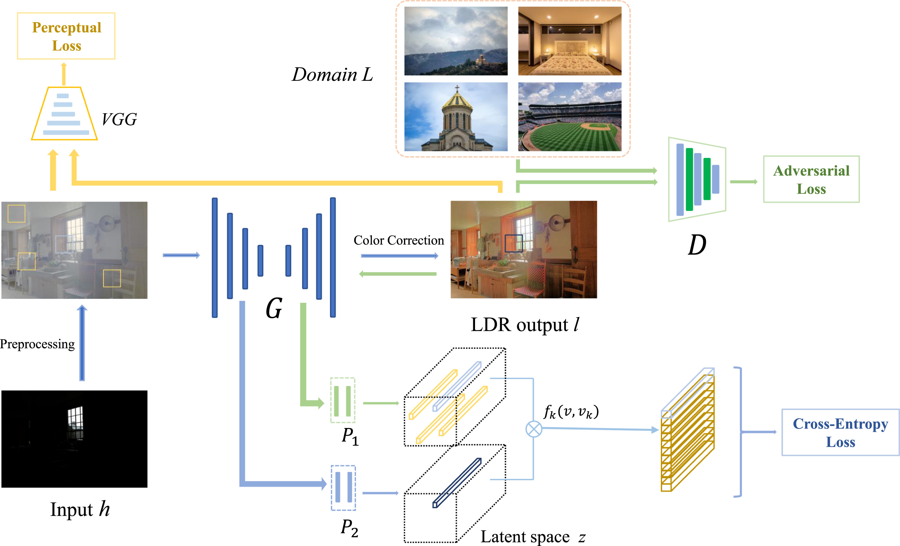

# Contrastive learning for deep tone mapping operator 
By [Di Li](https://scholar.google.com/citations?user=r6WfS2gAAAAJ), [Mou Wang](https://scholar.google.com/citations?user=tNzlqKQAAAAJ&hl) and [Susanto Rahardja](https://scholar.google.com/citations?user=OdkA4jMAAAAJ&hl=en) 

## Introduction

The codebase provides the official PyTorch implementation for the paper ["Contrastive learning for deep tone mapping operator"](https://www.sciencedirect.com/science/article/pii/S0923596524000316) (accepted by
Signal Processing: Image Communication).

<p align="center">
  
</p>

In this project, we present a straightforward yet efficient framework to automatically learn the priors and perform tone mapping in an end-to-end manner. The proposed algorithm utilizes a contrastive learning framework to enforce the content consistency between high dynamic range (HDR) inputs and low dynamic range (LDR) outputs. Since contrastive learning aims at maximizing the mutual information across different domains, no paired images or labels are required in our algorithm. Equipped with an attention-based U-Net to alleviate the aliasing and halo artifacts, our algorithm can produce sharp and visually appealing images over various complex real-world scenes, indicating that the proposed algorithm can be used as a strong baseline for future HDR image tone mapping task. 

## Dependencies 

- Python 3 (Recommend to use [Anaconda](https://www.anaconda.com/download/#linux))
- [PyTorch >= 1.0](https://pytorch.org/)
- Opencv
- Imageio
- [visdom](https://github.com/facebookresearch/visdom)

## Datasets

For HDR domain, we collected 930 images from various sources, including SYNS dataset, HDRI dataset and other opensource websites. For LDR domain, we randomly selected 400 high-resolution and high-quality images from a freely-usable website.

The final directory structure is as follows.

```
./data/HDR
    trainA/         # 16-bit RAW HDR inputs
    trainB/         # 8-bit sRGB train groundtruth
    testA/          # 16-bit RAW HDR inputs
```
## Train
- run visdom to monitor status
```
visdom
```
- run
```bash
python train.py --name CATMO --dataroot ./data/HDR --batch_size 2 --gpu_ids 0 --netG aunet --model cut --lambda_NCE 10 --nce_includes_all_negatives_from_minibatch --netD basic --spectral_norm
```

## Test
- run
```bash
python test.py --dataroot ./data/HDR/testA --name CATMO --gpu_ids 0 --netG aunet 
```

## Citation
If you find this repository useful, please kindly consider citing the following paper:

```BibTeX
@article{li2024contrastive,
  title={Contrastive learning for deep tone mapping operator},
  author={Li, Di and Wang, Mou and Rahardja, Susanto},
  journal={Signal Processing: Image Communication},
  pages={117130},
  year={2024},
  publisher={Elsevier}
}
```

## License

Our project is licensed under a [MIT License](LICENSE).